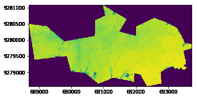

# Palm Oil Analytics

It was found that precipitation has the highest positive correlation with FFB Yield. This analysis aims to compare the oil palm plantation's Normalized Difference Vegetation Index (NDVI) between the dry & wet season to analyze the effects of precipitation on oil palm trees. A higher NDVI is associated with higher rates of photosynthesis & thus higher production of Fresh Fruit Bunch (FFB) yield. Therefore, Precipitation affects NDVI which affects FFB yield. On top of that, the time difference between dry & wet season should be minimal to ensure that the observed oil palm trees are in similar growth phases between the two seasons so that the growth phase has minimal impact on NDVI values to emphasize only the effects of precipitation on NDVI & thus FFB. Reference can be found in the following research paper https://www.researchgate.net/publication/281508567_Estimating_oil_palm_yields_using_vegetation_indices_derived_from_QuickBird

Sentinel-2 satellite imagery was used for the analysis which has a spatial resolution of 10m/pixel. An oil palm plantation situated in West Java Indonesia was selected as the area-of-interest due to it's sheer size amounting to 6.6km^2 or 660ha which will produce ample results with medium-resolution satellite imagery acquired from Sentinel-2 which can't be acheived by a smaller area-of-interest. Area-of-interest can be found in Open Street Map https://www.openstreetmap.org/edit#map=16/-6.5148/106.7299

Steps 1-7 were executed in **NDVI_Sentinel_Dry.ipynb** & **NDVI_Sentinel_Wet.ipynb** respectively. Then step 8 is documented in **Analysis.ipynb**.

1. AOI defined in geojson & shapefile
2. Sentinel-2 Imagery of AOI downloaded via Sentinel Hub's API
3. RGB image created & masked with AOI bounding box
4. NDVI calculated with ndvi = (Near-Infrared Band - Red Band) / (Near-Infrared Band + Red Band)
5. NDVI image created & masked with AOI bounding box
6. Histogram of NDVI values were plotted
7. Steps 2-6 repeated with different temporal timeframe
8. Histogram of NDVI values for AOI during different temporal timeframes compared ie between dry & wet season

Constant variable = growth phase of oil palm trees (assumption)

Manipulated variable = seasonal weather (time) ~ precipitation

Responding variable = NDVI ~ FFB Yield

